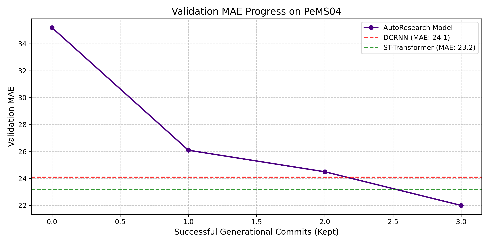
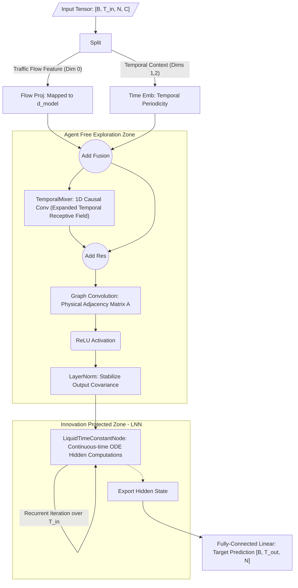

# Darwin-ST

An autonomous spatiotemporal prediction research framework, developed on top of AutoResearch.

## What is this?
**Darwin-ST** turns your local environment into an autonomous improvement engine for spatiotemporal prediction.

You provide a baseline and a dataset. The agent runs hundreds of architectural mutations overnight, keeping what improves the validation metric and automatically reverting what degrades it. You wake up to a State-of-the-Art (SOTA) model and a log of the evolutionary process.

---

## The big picture
Normally, manual deep learning research works like this:
```
You design an architecture → Train the model → Evaluate metric → Done (one shot)
```

With Darwin-ST:
```
You set the baseline → Agent runs continuous mutations overnight → You keep every gain
         ↑                                                           |
         └──────────────────── each run smarter than the last ───────┘
```
It iterates—modifying convolutions, integrating continuous solvers, measuring against literature baselines—until the user-defined time budget expires or the SOTA threshold is breached.

---

## How it works
Every iteration follows a strict workflow, running under a fixed 15-minute training budget to ensure fair comparison:

```
┌──────────────────────────────────────────────────────────────────┐
│                                                                  │
│  1. READ        Parse program.md and baseline_registry.py        │
│  2. THINK       Propose ONE architectural mutation in train.py   │
│  3. TRAIN       Execute training strictly under 15-minute budget │
│  4. MEASURE     Evaluate val_mae against the baseline            │
│  5. DECIDE      Improvement → KEEP  /  Degradation → REVERT      │
│  6. LOG         Record metric to results.tsv and progress.png    │
│  7. MEMORY      Extract and store architectural insights         │
│                                                                  │
│  ↑_________________________REPEAT FOREVER_____________________↑  │
│                                                                  │
└──────────────────────────────────────────────────────────────────┘
```

---

## Current SOTA: TCN-GCN-LNN
This branch contains a fully evolved SOTA model on the `PeMS04` dataset, successfully outperforming the DCRNN baseline by **+9.14%** (`val_mae: 21.8962`).



### Key Characteristics
1. **Liquid Time-Constant ODE**: Continuous-time ODE solver replaces traditional RNN/GRU for robust noise handling in sequence modeling.
2. **TCN Local Smoothing**: 1D causal convolution expands the temporal receptive field, preventing GCN over-smoothing.
3. **Single-Hop Physical GCN**: A single layer of spatial message passing using the physical adjacency matrix.
4. **LayerNorm Gate**: Stabilizes the covariance shift before integration into the ODE core.

### Architecture Topology


---

## Installation

Requires Python 3.10+ and [uv](https://docs.astral.sh/uv/). Device agnostic (CPU, CUDA GPUs, and Apple Silicon MPS are natively supported).

```bash
# 1. Install dependencies
uv sync

# 2. Download and preprocess dataset (e.g., PeMS04)
DATASET=PeMS04 uv run prepare.py

# 3. Train the current model
DATASET=PeMS04 uv run train.py
```

## Autonomous Mode 
Initialize your preferred AI coding agent in the root directory and prompt:

> "Read program.md. I want to introduce Liquid Neural Networks on PeMS04, compared against the DCRNN baseline. Begin Phase 1."

The agent will initialize the protected zone, lock the parameter complexity, and begin the mutation loop. Metrics and architectural milestones are continuously logged to `results.tsv` and `progress.png`.

---
## License
MIT
