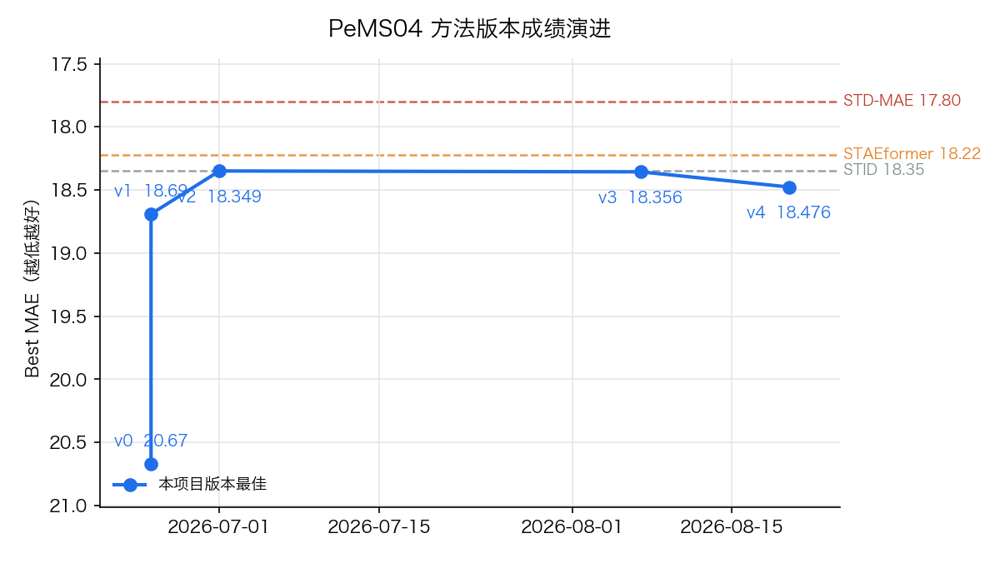

# Darwin-ST 排行榜

自治时空预测研究系统 (进化 NAS + LLM 跨域创造) 的方法版本榜: 每个大版本只上榜其最佳模型, 展示方法一版版变强的演进主线。

## 方法版本榜 (PeMS04)

参照 SOTA: **STD-MAE** (MAE 17.80); MAE 越低越好。

| 版本 | 日期 | Best MAE | vs SOTA | 榜单位次 | Tag | 复盘 |
|---|---|---:|---:|---:|---|---|
| **v0** 纯 NAS + HPO 进化搜索（无 Tier-2 创造），传统 AutoML 天花板 | 2026-06-25 | **20.67** | +2.87 | **11** / 12 | — | [复盘](../docs/SERVER_VALIDATION.md) |
| **v1** Tier-2 创造闭环首通：LLM 跨域合成算子注入进化（线程版） | 2026-06-25 | **18.69** | +0.89 | **8** / 12 | — | [复盘](../docs/SERVER_VALIDATION.md) |
| **v2** Stage1 搜索空间升级（joint/cross/iterative fusion）+ 24h 长跑 | 2026-07-01 | **18.349** | +0.55 | **6** / 12 | `v-sota-pems04-18.35` | [复盘](../docs/SOTA_RETROSPECTIVE.md) |
| **v3** Tier-2 v1 方法升级（履历/家谱精炼/proxy/信用分/独立采样 + 631 卡机制库） | 2026-08-07 | **18.356** | +0.56 | **7** / 12 | `acceptable+18.356` | [复盘](../docs/TIER2_V1_RETROSPECTIVE.md) |
| **v4** B7 训练方式创造通道上线（aux 契约/七门验证/训练链路）— 收关定性：aux 路由失效(activation=0)+反思未触发，非机制负结果 | 2026-08-20 | **18.476** | +0.68 | **7** / 12 | `b7-v1-routing-failure-18.476` | [复盘](../docs/B7_V1_CLOSEOUT.md) |

> 位次口径: 该版本最佳单独与已发表 baseline 混排 (不同版本互不占位); 完整模型存档见 [PeMS04.md](PeMS04.md)。

> ⚠️ **指标口径声明**: 本项目版本行 Best MAE 为**验证集 (val) MAE** (split 6/2/2, masked metric, 12 horizons 平均); 已发表 baseline/SOTA 数值为**文献报告的 test MAE**。两者口径不同, 混排位次仅供演进参照, 不构成严格可比的排名结论。

## 成绩随版本演进

## 当前最佳

- **v2** (2026-07-01): Best MAE **18.349**, 榜单位次 **6** / 12, 距 SOTA (STD-MAE 17.80) +0.55
- 模型卡: [models/PeMS04/05_mae18.35_f93f4598](models/PeMS04/05_mae18.35_f93f4598/)
- git tag: `v-sota-pems04-18.35`

## 完整存档与设计文档

- 完整模型存档榜 (全部入榜模型 + baseline 混排): [PeMS04.md](PeMS04.md)
- 各版本复盘与设计文档: [docs/](../docs/)
